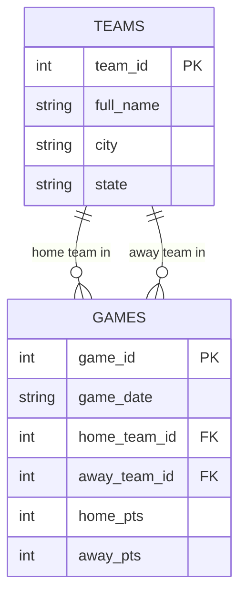

**Before you start:** rename this file to `unit3b_lastname.md`, using your own last name. Read `unit3b_Walkthrough.md` first. Commit and push when you're done.

**Name:**

---

# Unit 3b — Keys and Relationships

## 1. Which key?

For each table, decide: is the primary key **natural** (a real-world value that already exists, like an email) or **surrogate** (a made-up ID number)? Is it **composite** (more than one column)?

| Table | Primary key | Natural or surrogate? | Composite? |
|---|---|:-:|:-:|
| `teams` in `nba_5seasons.db` | `team_id` |Surrogate |No |
| `player_season_stats` in `nba_5seasons.db` |(player_id, season) |Surrogate (combined) |Yes |
| A US state table | `state_abbrev` (OH, MI, PA…) |Natural |No |
| The school's student records | `student_id` |Surrogate |No |

**a.** The school could use a student's full name as the primary key instead of `student_id`. Give one reason that's a bad idea.

**Answer:**
Full names are not unique (multiple students can share the exact same first and last name), and names can legally change, which breaks primary key uniqueness and stability.

## 2. What a foreign key promises

**b.** In `denormalized_demo.db`, `games.home_team_id` is a foreign key to `teams.team_id`. If someone tries to insert a game with `home_team_id = 99` and there is no team 99, what should the database do? What is that rule called?

**Answer:**
CASCADE DELETE: Automatically delete all associated game records where team 6 was involved.

**c.** If team 6 were deleted from `teams`, what should happen to its rows in `games`? Name two different choices a designer could make.

**Answer:**RESTRICT / PREVENT: Block the deletion of team 6 as long as game records referencing team 6 exist in the games table.


## 3. Sort the relationships

**Choose from:** One-to-one · One-to-many · Many-to-many

| # | Relationship | Type |
|:-:|---|---|
| 1 | One team → its games this season | One-to-many|
| 2 | Students ↔ the courses they're enrolled in | Many-to-many|
| 3 | A person → their Social Security number |One-to-one |
| 4 | A customer → their orders |One-to-many |
| 5 | Movies ↔ the actors in them |Many-to-many |
| 6 | A country → its capital city | One-to-one|

**d.** Pick either many-to-many row. Relational databases can't store a many-to-many directly. What table do you add, and what columns does it need?

**Answer:**You add a junction table (such as enrollments or movie_cast). It needs at least two foreign key columns (student_id and course_id, or movie_id and actor_id) referencing the primary keys of the two main tables.


**e.** Not every database uses tables and keys. In a **graph** database (like the one behind Instagram's follow list), the same "who follows whom" relationship is stored as what two things? In a **key-value** store, how is a relationship handled?

**Answer:**Not every database uses tables and keys. In a graph database (like the one behind Instagram's follow list), the same "who follows whom" relationship is stored as what two things? In a key-value store, how is a relationship handled?


## 4. Your first ER diagram

Here is the `denormalized_demo.db` fixed version as a Mermaid diagram. It already renders — push and look at it on GitHub or preview it in VS Code.



**Now make your own, using AI.** Follow the four steps in the walkthrough: plan it, prompt the AI, proof it, test it. A school schedule has these entities: **STUDENTS**, **COURSES**, **TEACHERS**, and an **ENROLLMENTS** junction table. Rules:

- One teacher teaches many courses; each course has one teacher.
- Students take many courses; courses have many students. (That's what ENROLLMENTS is for.)

Give every entity a primary key and at least two attributes. Mark the foreign keys.

```mermaid
erDiagram
    %% replace this comment with your diagram
erDiagram
    TEAMS ||--o{ GAMES : "home team in"
    TEAMS ||--o{ GAMES : "away team in"
    TEAMS {
        int team_id PK
        string full_name
        string city
        string state
    }
    GAMES {
        int game_id PK
        string game_date
        int home_team_id FK
        int away_team_id FK
        int home_pts
        int away_pts
    }
```

**Paste the prompt you gave the AI.** If you used a PowerPoint picture, add the picture to your repo too.

```text
erDiagram
    TEACHERS ||--o{ COURSES : "teaches"
    STUDENTS ||--o{ ENROLLMENTS : "enrolls in"
    COURSES ||--o{ ENROLLMENTS : "has enrollment"

    TEACHERS {
        int teacher_id PK
        string teacher_name
        string department
    }
    COURSES {
        int course_id PK
        string course_title
        int teacher_id FK
    }
    STUDENTS {
        int student_id PK
        string student_name
        int grade_level
    }
    ENROLLMENTS {
        int student_id PK, FK
        int course_id PK, FK
        string letter_grade
    }
```

**f.** Which entity has two foreign keys? What should its primary key be?

**Answer:**ENROLLMENTS has two foreign keys (student_id and course_id). Its primary key is a composite primary key made up of both (student_id, course_id) combined.


**g.** What did you have to fix in the AI's diagram? If you didn't change anything, what did you check to make sure it was right?

**Answer:**Checked that the crow's foot symbols (||--o{) were oriented correctly—ensuring the "one" side was on TEACHERS, STUDENTS, and COURSES, and the "many" side pointed toward COURSES and ENROLLMENTS. Also verified that foreign keys (FK) were clearly denoted.


## Closing 3b — Vocabulary

| Term | Your definition |
|---|---|
| Entity |A real-world object, person, or concept that a database stores information about (represented as a table). |
| Attribute |A single characteristic or data item describing an entity (represented as a table column). |
| Natural key |A primary key based on a real-world value that naturally exists outside the database system. |
| Surrogate key |An artificially generated unique identifier created specifically for database tracking (e.g., ID numbers). |
| Composite key |A primary key made by combining two or more columns together to form a unique identifier. |
| Referential integrity | A database integrity rule requiring foreign key values to match an existing primary key value in a related table or be NULL.|
| Junction table | |
| Cardinality | The quantitative nature of the relationship between entities (e.g., 1:1, 1:N, N:M).|

**Partner check:** trade files. Read your partner's Mermaid code out loud, one relationship line at a time, as English ("one teacher, many courses"). If it doesn't read right, one of you has the crow's foot on the wrong end.
